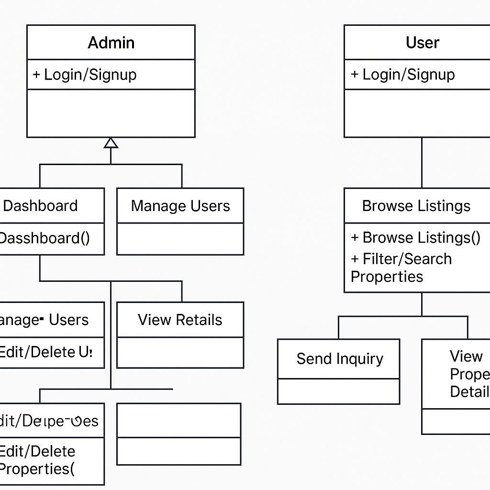

# Property Listing Platform

# 🌐 [Live Demo → keyvistaa.netlify.app](https://keyvistaa.netlify.app/)

A fully frontend-focused property listing web application aimed at enhancing the real estate experience for both users and administrators. This project is designed to be responsive, interactive, and user-friendly, offering features like advanced filtering, property comparison, inquiry handling, and mobile optimization.

---

## 🚀 Project Goal

To build a frontend real estate listing platform where users can easily search, view, compare, and inquire about properties, with a sleek, responsive UI optimized for all devices.

---

## 🌟 Features

### 1. **Real-Time Advanced Filters**
- Filter by property type, price, location, and amenities.
- Multi-select dropdowns and interactive sliders.
- Map-based filtering with live result updates.

### 2. **Interactive Property Details**
- High-quality image carousel and video tours.
- Interactive maps with nearby points of interest.
- Floor plans and virtual room tours.

### 3. **Inquiry System**
- Quick contact form per property.
- Real-time form validation.
- Confirmation messages and agent details.

### 4. **Responsive Mobile Design**
- Touch-friendly filters, sliders, and navigation.
- Fully responsive grid and layout.

### 5. **Favorites & Comparison Tools**
- Save favorite properties across sessions.
- Compare multiple listings side-by-side.

### 6. **Sorting & Views**
- Sort by price, date, or distance.
- Switch between grid, list, and map views.

### 7. **Pagination / Infinite Scroll**
- Load more listings dynamically or paginate through structured results.

### 8. **AI-Powered Enhancements** *(Planned)*
- Personalized suggestions based on user behavior.
- Virtual property staging for better visualization.

---

## 🛠️ Technologies Used

- **HTML5** / **CSS3** / **JavaScript**
- **Responsive Design** principles
- **Local Storage** for session persistence
- **Map APIs** *(planned)*

---

## 📁 Project Structure

---

## 👤 User Flow Diagram




### 👥 Roles

#### 1. **User**
- Browse homepage → Apply filters → View listings
- View property details → Contact agent or save property
- Compare properties → Submit inquiry

#### 2. **Admin** *(if integrated later)*
- Add/edit/delete property listings
- Manage media and inquiries
- Moderate property content

---

## 💡 How to Run Locally

1. Clone the repository:

```bash
git clone https://github.com/jatingrg/Propertylistingweb.git
```
2. Navigate into the project:

``` bash
 cd Propertylistingweb
```
3. Open index.html in any browser:

``` bash
start index.html
```


